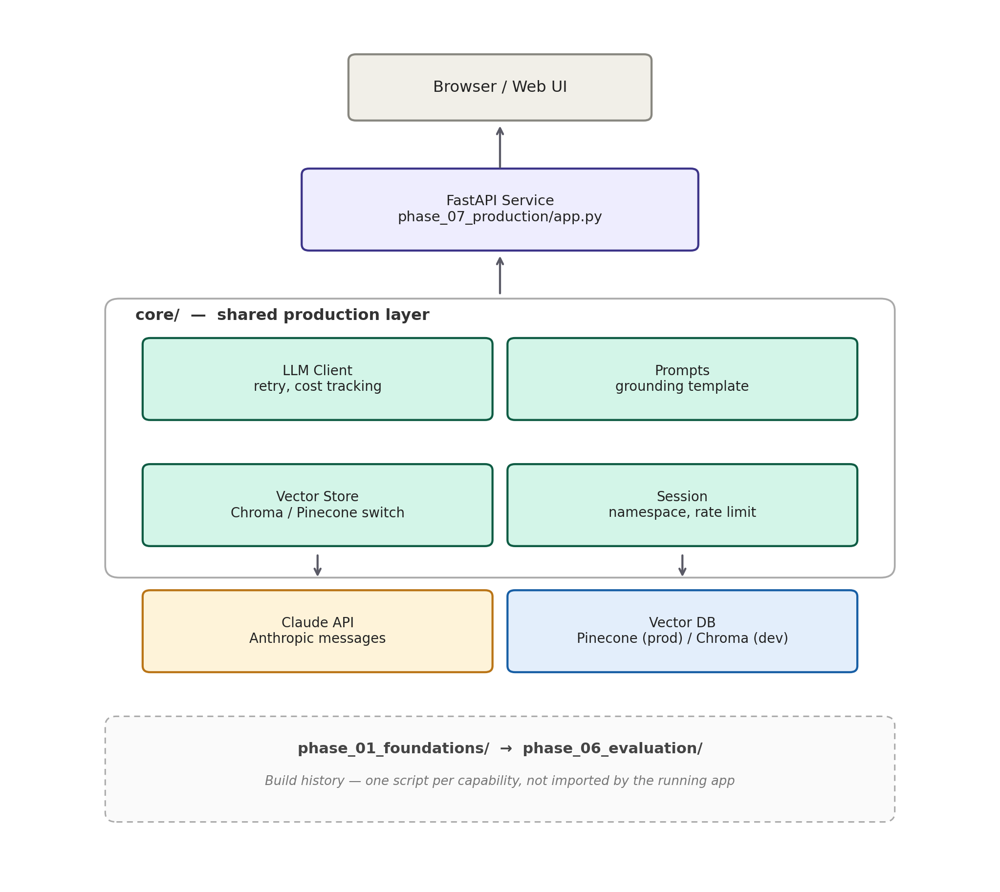

# AI Research Assistant

An agentic RAG system that answers questions from uploaded documents (PDF, DOCX, TXT, Markdown) with enforced grounding, multi-agent fact-checking, and measured evaluation quality — built end-to-end from raw token mechanics to a deployed, containerized API.

**[Live demo →](https://ai-research-assistant-ojsy.onrender.com)** &nbsp;·&nbsp; **[Demo video →](#)** &nbsp;·&nbsp; Built by [Rambhupal Payyavula](https://rambhupalpayyavula.com)

---

## What it does

Upload a document. Ask a question about it. Get an answer grounded only in what you uploaded — with citations pointing back to the exact source, and an explicit refusal if the answer genuinely isn't in the document, instead of a guess.

- **Never hallucinates a source** — every claim traces back to a retrieved chunk, verified by a separate adversarial fact-checking pass
- **Refuses honestly** when the answer isn't in the uploaded documents, rather than making one up
- **Session-isolated** — each visitor's uploads live in their own namespace; no cross-contamination between users
- **Measured, not assumed** — evaluated with RAGAS (faithfulness, relevancy, context precision/recall) against a golden test set, not just eyeballed

## Architecture



The FastAPI service and `core/` modules are the actual production system. `phase_01` through `phase_06` are preserved standalone scripts documenting how each capability (RAG, agents, multi-agent orchestration, evaluation) was built and validated before being promoted into `core/` — a record of the build process, not a dependency of the running app.

## Tech stack

| Layer | Tools |
|---|---|
| LLM | Anthropic Claude (Sonnet) |
| Orchestration | LangChain, LangGraph |
| Retrieval | Pinecone (production) / ChromaDB (local dev), sentence-transformers |
| Evaluation | RAGAS, custom LLM-as-judge harness |
| API | FastAPI, Pydantic |
| Deployment | Docker, Render |

## How it was built

This project was built in seven phases, each one adding a capability on top of the last, with a full theory-and-practice writeup at every stage:

1. **LLM foundations & prompt engineering** — tokenization, embeddings, attention, the six core prompt patterns, and the grounded-answer contract every later phase builds on
2. **Embeddings & vector databases** — semantic search, ANN indexing, similarity metrics, the ChromaDB → Pinecone architecture decision
3. **RAG** — chunking strategy, two-stage retrieval, the full retrieve → ground → generate loop, real multi-format document ingestion (PDF/DOCX/TXT/MD)
4. **AI agents & tool use** — the ReAct loop, real tool_use/tool_result API mechanics, parallel tool calls
5. **Multi-agent orchestration** — supervisor-worker pattern, LangGraph state machines, a dedicated fact-checking agent
6. **Evaluation, guardrails & observability** — a golden test set, hand-built LLM-as-judge, and full RAGAS evaluation (faithfulness, relevancy, context precision/recall)
7. **Production deployment & MLOps** — FastAPI, session/namespace isolation, cost controls, Docker, live deployment

A full theory-and-diagrams writeup of every phase is documented separately — happy to share on request.

## Real production issues hit and fixed

Worth knowing this wasn't a frictionless build — a few genuine bugs came up along the way, each one diagnosed from evidence rather than guessed at:

- **Fact-check ordering bug** — the multi-agent graph originally verified a draft answer *before* a later summarization step could still modify it, meaning the fact-check wasn't actually checking what shipped. Caught by comparing outputs across two runs, fixed by reordering the graph so verification runs last.
- **Embedding model reload on every request** — the FastAPI service was reloading `sentence-transformers` from scratch on every single API call. Fixed with a module-level cache and a startup warm-up pass, cutting steady-state latency significantly.
- **Out-of-memory crash on Render's free tier** — a real request (not just a health check) crashed the container under a 512MB memory cap. Diagnosed from an unexpected process restart in the server logs, resolved by upgrading to a 2GB instance.

## Setup

```bash
git clone https://github.com/RambhupalPayyavula/ai-research-assistant.git
cd ai-research-assistant
python3.12 -m venv venv
source venv/bin/activate
pip install -r requirements.txt
```

Create a `.env` file:
```
ANTHROPIC_API_KEY=your_key_here
PINECONE_API_KEY=your_key_here
```

Run locally (uses ChromaDB by default — no Pinecone account needed for local dev):
```bash
uvicorn phase_07_production.app:app --reload
```

Visit `http://localhost:8000`.

### Run with Docker

```bash
docker build -t ai-research-assistant .
docker run -p 8000:8000 \
  -e ANTHROPIC_API_KEY=your_key \
  -e PINECONE_API_KEY=your_key \
  -e VECTOR_STORE=chroma \
  ai-research-assistant
```

Set `VECTOR_STORE=pinecone` to use Pinecone instead of the local ChromaDB store — this single environment variable is the entire difference between the local development configuration and the deployed production configuration; no code changes required.

## Project structure

```
core/                       shared production infrastructure
  llm_client.py             cost/latency-tracked Claude client with retry logic
  prompts.py                the grounded-answer prompt contract
  vector_store.py           Chroma/Pinecone backend switch, session namespacing
  session.py                session identity, rate limiting, upload caps
  document_loader.py        PDF/DOCX/TXT/MD parsing and chunking

phase_01_foundations/       → phase_06_evaluation/
                             one script per capability, preserved as build history

phase_07_production/
  app.py                    the deployed FastAPI service
  static/index.html         the web UI

sample_documents/           test fixtures for exercising the ingestion pipeline
Dockerfile
requirements.txt
```

## Known limitations

- Semantic search only — no hybrid keyword/BM25 matching, so exact-term lookups (SKUs, clause numbers) can underperform conceptual queries
- Scanned/image-only PDFs aren't supported (no OCR)
- CSV/XLSX intentionally unsupported — tabular data needs a different retrieval approach than semantic chunking
- Session state is in-memory, not shared across multiple server instances — fine at current scale, would need Redis for horizontal scaling

## License

MIT
